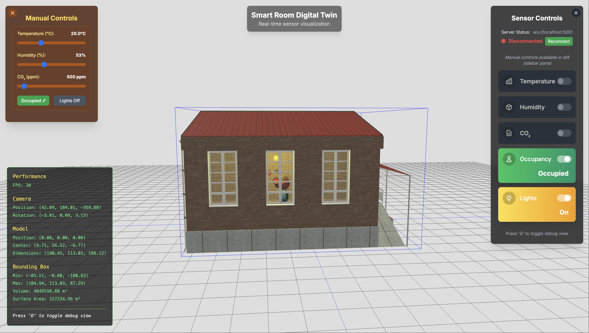
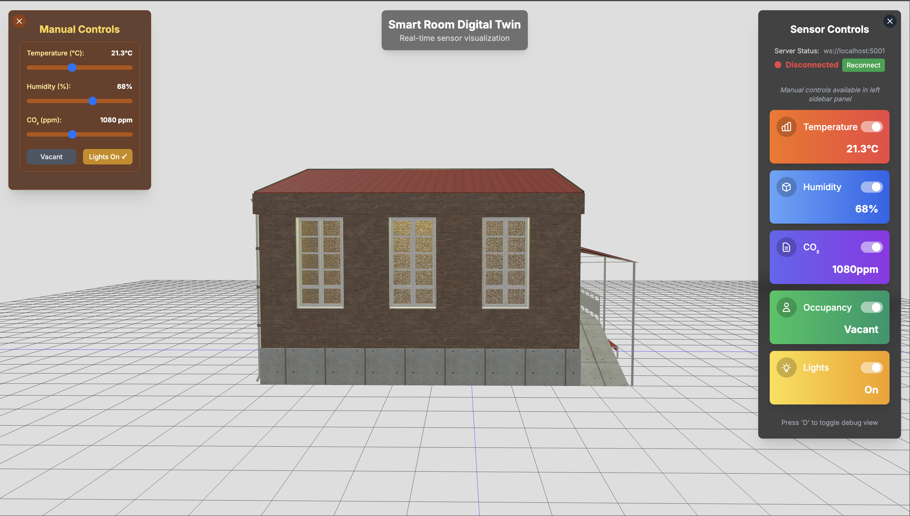
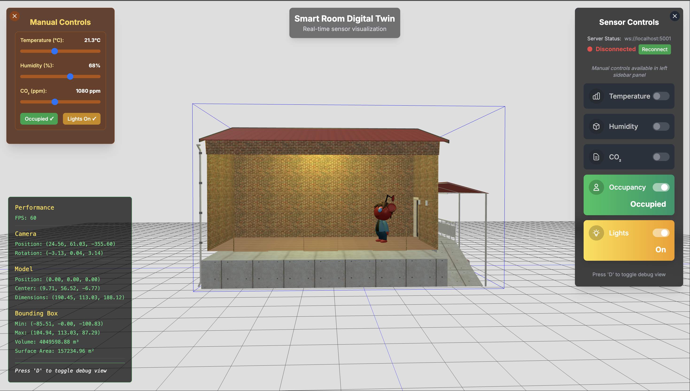

# Smart Room Digital Twin (Frontend)

A real-time 3D visualization of smart home sensors using Three.js, React, and WebSockets. This frontend application creates an interactive digital twin that displays environmental data (temperature, humidity, CO2), occupancy status, and lighting conditions.



## Features

- **3D Visualization**: Interactive 3D model of a smart room with real-time sensor visualizations
- **Sensor Visualizations**:
  - **Temperature**: Particle effect with color gradient (blue to red)
  - **Humidity**: Fog effect that intensifies with humidity levels
  - **CO2**: Black particle effect with density based on PPM levels
  - **Occupancy**: Avatar model that appears when room is occupied
  - **Lighting**: Light model that turns on/off based on light sensor
- **Manual Mode**: Override sensor values for testing and demonstration
- **Keyboard Controls**: Navigate the 3D scene using keyboard controls
  - Arrow keys for movement
  - +/- keys to adjust movement speed
- **Debug Tools**: Visualize scene information and bounding boxes
- **Loading Animation**: Custom 3D loader while model is loading

## Screenshots


_Manual control panel for overriding sensor values during testing_


_Debug view with bounding boxes and scene information for development_

## Tech Stack

- **Frontend**:
  - Next.js (React framework)
  - Three.js for 3D rendering
  - Tailwind CSS for styling
  - WebSocket client for real-time data communication

## Repositories

- **Frontend**: [https://github.com/amanrathore48/smart-room-digital-twin](https://github.com/amanrathore48/smart-room-digital-twin)
- **Backend**: [https://github.com/amanrathore48/smart-room-server](https://github.com/amanrathore48/smart-room-server)

## Backend Integration

This frontend application connects to a separate backend service that handles sensor data and WebSocket communication. The backend repository must be set up separately to enable real-time data functionality.

## Setup Instructions

### Prerequisites

- Node.js (v14 or higher)
- npm or yarn

### Installation

1. Clone the repository:

   ```bash
   git clone https://github.com/amanrathore48/smart-room-digital-twin.git
   ```

2. Install frontend dependencies:
   ```bash
   npm install
   ```

### Running the Frontend

1. Start the frontend development server:

   ```bash
   npm run dev
   ```

2. Open your browser and navigate to `http://localhost:3000`

### Backend Connection

This frontend application expects a WebSocket connection to a backend server. By default, it will try to connect to `ws://localhost:5001`.

To enable real-time functionality, you need to:

1. Set up the backend from the separate backend repository
2. Start the backend server before using real-time features in the frontend
3. Alternatively, use the Manual Control Panel in the frontend for testing without a backend connection

## Usage Guide

### Sensor Panel

- Toggle the visibility of each sensor visualization
- Monitor current sensor values
- Disconnect/Reconnect from the WebSocket server

### Manual Control Panel

- Enable manual mode to override sensor values
- Adjust temperature, humidity, and CO2 levels using sliders
- Toggle occupancy and lighting status

### Keyboard Controls

- **Navigation**:
  - Arrow keys to move camera position
  - +/- keys to adjust movement speed
  - Click and drag to rotate the view
  - Scroll to zoom in/out
- **Display Options**:
  - F key to toggle fullscreen mode
  - D key to toggle debug mode (shows bounding boxes and stats)

## Project Structure

```
public/                  # Static assets including 3D models
  red-house-2.glb        # Main house 3D model
  avatar.glb             # 3D avatar model for occupancy visualization
  particle.png           # Particle texture for effects

src/
  app/                   # Next.js app directory
    globals.css          # Global styles
    layout.jsx           # Root layout
    page.jsx             # Main application page
  components/            # React components
    ModelLoader.jsx      # 3D model loading animation
    SmartRoomScene.jsx   # Main 3D scene component
    SensorPanel.jsx      # Display and control for sensors
    ManualControlPanel.jsx # Controls for manual mode
    DebugTools.jsx       # Debug information panel
    KeyboardControls.jsx # Keyboard navigation controls

    visualizers/         # Sensor effect components
      TempParticle.jsx   # Temperature visualization
      Fog.jsx            # Humidity visualization
      CO2.jsx            # CO2 level visualization
      LightModel.jsx     # Light status visualization
      Occupancy.jsx      # Occupancy visualization

  context/               # React context providers
    SensorContext.jsx    # Context for sensor data

  utils/                 # Utility functions
    threeJsHelpers.js    # Helper functions for Three.js

docs/                    # Documentation and screenshots
  ss-main.png           # Main scene screenshot
  ss-debug.png          # Debug view screenshot
  ss-manual.png         # Manual control panel screenshot
```
